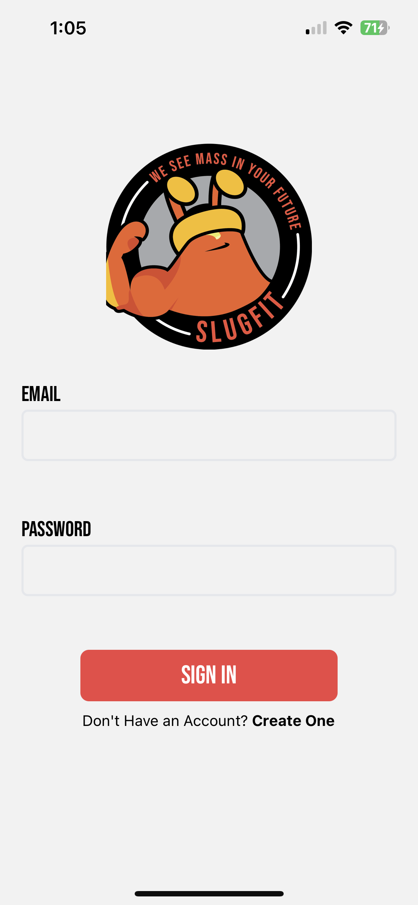
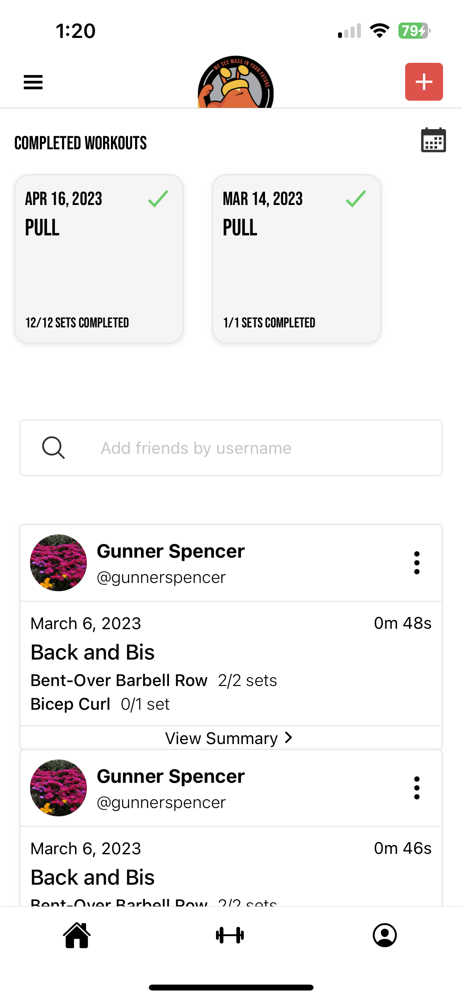
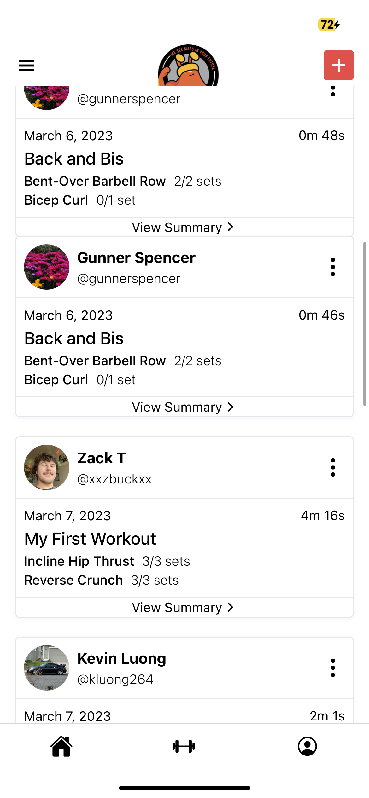
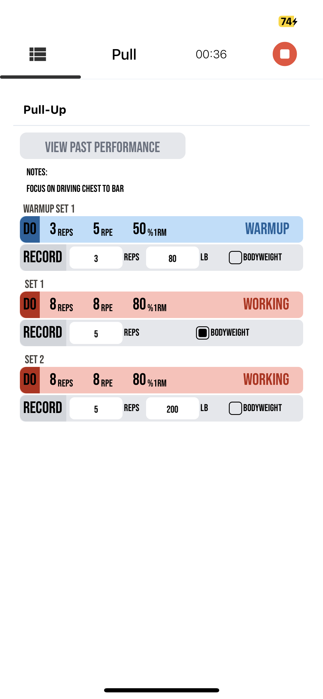

# SlugFit
SlugFit is a fitness app inspired by the block-based UI of Notion. It's a cross-platform (iOS and Android) app built using React Native. The app is designed to cater to users with both some experience in fitness and to little to no experience.  It provides features for creating, saving, and editing workouts, as well as social interactions and workout analysis.

## Features
 - Create and manage workouts with a block-based UI
 - Add and edit exercises within workouts
 - Create user profiles with profile pictures
 - Social media features to view friends' workouts and add them to your own
 - Automatic workout sharing with friends
 - Workout analysis based on past performance
 - Integrated calendar to keep track of workouts
 - Built with TypeScript, Figma (UI), Supabase (PostgreSQL database), Expo (development),  - and Yarn (package manager)
   

# Environment Setup
 - Install Node:
 - https://nodejs.org/en/download/
 - Install Yarn:
 - https://classic.yarnpkg.com/lang/en/docs/install/
   

# App Installation
1. Clone this repository
2. Set githooks with `git config core.hooksPath ./.githooks`
3. Navigate to the root of the repository and run `yarn` to install all dependencies
4. Run `yarn start` to begin the development server
5. If you have XCode installed and an iPhone simulator, press `i` to open the simulator and run the app. Otherwise, install the Expo Go app on your phone and scan the QR code from the terminal with your camera to run the app on your phone in Expo Go. Make sure your phone and laptop are connected to the same Wi-Fi network to use the latter option.
  

# Commands
 - `yarn start` to begin the development server
 - `yarn ios` to run iOS simulator
 - `yarn android` to run Android simulator
 - `yarn lint` to lint code
 - `yarn lint:fix` to fix simple linting errors
 - `yarn` format to format code according to style guide
 - `yarn test` to run unit tests
  

# Screenshots

<figure style="display: flex; flex-direction: column; align-items: center;">

  
 
</figure>
<figure style="display: flex; flex-direction: column; align-items: center;">

  
  
</figure><figure style="display: flex; flex-direction: column; align-items: center;">

  
  
</figure><figure style="display: flex; flex-direction: column; align-items: center;">

  
</figure>

### **More screenshots available on the ./screenshots directory or visit https://paulsimbulan.com**

# Video Demo
<video width="600px" controls>
  <source src="./demovideo/slugfit_demo.mp4" type="video/mp4">
  Your browser does not support the video tag.
</video>

### if video doesn't load or work, try this link https://youtu.be/2OFljDC_c74

# Contributing

Contributions are welcome! Please feel free to submit pull requests or create issues to report bugs or suggest improvements.

# License
This project is open-source and available under the MIT License.
